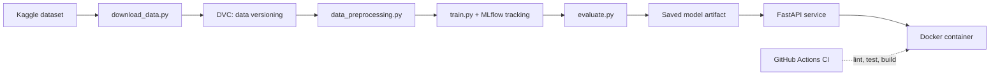

# Sri Lanka Flood Risk Early Warning: An End-to-End MLOps Pipeline


A reproducible machine learning pipeline that predicts, 48 hours in advance, whether a Sri Lankan district will enter a flood advisory. The focus is on production practices: versioned data, tracked experiments, a containerized inference API, automated tests and CI/CD.

> **Status:** work in progress. Sections marked `TODO` are filled in as the project develops.

---

## Problem

Sri Lanka regularly faces monsoon flash floods, river overflows and localized inundation. Traditional alerts often treat rainfall volume the same everywhere, ignoring how extreme a rainfall event is for a particular district and how saturated the ground already is. This project uses district-level climate and soil data to forecast flood advisories early enough to act on.

## Dataset

**Source:** [Sri Lanka District Climate and Flood Risk (2015-2024)](https://www.kaggle.com/datasets/rasindupramith/sri-lanka-district-climate-and-flood-risk20152024) on Kaggle, derived from the ECMWF ERA5 reanalysis via the Open-Meteo API.

- **Size:** 91,325 rows (3,653 days x 25 districts), 1 Jan 2015 to 31 Dec 2024, no missing values
- **Granularity:** daily, one row per district per day

| Group | Variables |
|---|---|
| Location | `district`, `latitude`, `longitude`, `province`, `climatic_zone` (Wet / Intermediate / Dry) |
| Atmosphere | `precipitation_sum`, `rain_sum`, `temperature_2m_max`, `wind_speed_10m_max` |
| Hydrology | topsoil moisture (0-7 cm), subsurface moisture (7-28 cm), `rain_24h`, `rain_48h`, `rain_72h`, `soil_saturation_index` |
| Risk outputs | `flood_risk_score` (0-100%), `flood_category` (Low Risk, Advisory, High Warning, Critical Emergency) |

The risk score and category come from an Extreme Value Theory (Gumbel) model combined with soil saturation. They are model-derived labels, not records of observed flood damage (see [Limitations](#limitations)).

Raw data is **not** stored in Git. It is downloaded by `src/download_data.py` and tracked with DVC.

## ML Task

- **Target:** `advisory_48h`, which is 1 if the district's `flood_category` is Advisory or higher 48 hours after the observation date, otherwise 0.
- **Features:** current and lagged weather values, rolling rainfall accumulations, soil moisture and saturation, climatic zone, and seasonality (e.g. month). TODO: finalize the feature list.
- **Why 48 hours ahead:** `flood_risk_score` and `flood_category` are computed from same-day rainfall and soil variables. Predicting them from those same inputs would only reproduce the formula. Predicting ahead, using only information available at forecast time, is the meaningful problem.
- **Validation:** time-based split (train on earlier years, test on the most recent years) instead of a random split, to avoid leaking future information. TODO: confirm exact year ranges.
- **Metrics:** flood advisories are rare, so accuracy is misleading. We report precision, recall, F1 and PR-AUC.

## Architecture



## Tech Stack

| Area | Tools |
|---|---|
| Language | Python |
| ML | pandas, scikit-learn (TODO: add XGBoost / LightGBM if used) |
| Experiment tracking | MLflow |
| Data and pipeline versioning | DVC, Git |
| Serving | FastAPI, Pydantic, Uvicorn |
| Containers | Docker, Docker Compose |
| Testing and CI/CD | pytest, flake8, black, GitHub Actions |

## Repository Structure

```
flood-risk-mlops/
├── .github/workflows/main.yml   # CI: lint, test, build image
├── app/
│   └── main.py                  # FastAPI service
├── configs/
│   └── params.yaml              # hyperparameters and paths
├── data/                        # not in Git, managed by DVC
├── models/                      # saved model artifacts
├── notebooks/                   # exploration only
├── src/
│   ├── download_data.py
│   ├── data_preprocessing.py
│   ├── train.py
│   ├── evaluate.py
│   └── predict.py
├── tests/
├── dvc.yaml                     # pipeline stages
├── Dockerfile
├── docker-compose.yml
├── requirements.txt
└── README.md
```

## Getting Started

```bash
# 1. Clone and set up the environment
git clone https://github.com/YOUR_USERNAME/flood-risk-mlops.git
cd flood-risk-mlops
python -m venv .venv
source .venv/bin/activate        # Windows: .venv\Scripts\activate
pip install -r requirements.txt

# 2. Download the dataset
python src/download_data.py

# 3. Run the full pipeline (preprocess, train, evaluate)
dvc repro

# 4. Explore experiment runs
mlflow ui

# 5. Serve the model locally
uvicorn app.main:app --reload
```

### Run with Docker

```bash
docker build -t flood-risk-api .
docker run -p 8000:8000 flood-risk-api
# or
docker compose up
```

Interactive API docs are available at `http://localhost:8000/docs`.

## Experiment Results

TODO: fill in from MLflow after training.

| Run | Model | Key params | Precision | Recall | F1 | PR-AUC |
|---|---|---|---|---|---|---|
| 1 | Logistic Regression (baseline) | | | | | |
| 2 | Random Forest | | | | | |
| 3 | XGBoost / LightGBM | | | | | |

## API Usage

TODO: update the field names to match your final Pydantic schema.

```bash
curl -X POST http://localhost:8000/predict \
  -H "Content-Type: application/json" \
  -d '{
        "district": "Gampaha",
        "rain_24h": 85.2,
        "rain_48h": 140.7,
        "rain_72h": 190.3,
        "soil_saturation_index": 0.91
      }'
```

| Endpoint | Purpose |
|---|---|
| `POST /predict` | Advisory prediction for a single district |
| `POST /predict/batch` | Predictions for multiple rows |
| `GET /health` | Service health check |

## Testing and CI/CD

- **Unit tests (pytest):** preprocessing functions, data schema checks (expected columns, plausible value ranges, valid district names) and API response codes
- **GitHub Actions:** on every push and pull request, the workflow runs `flake8` and `black --check`, executes `pytest`, and builds the Docker image

```bash
pytest -q
```

## Limitations

- The labels are outputs of a statistical risk model built on reanalysis data, not confirmed flood events. Model performance reflects how well we reproduce that risk engine ahead of time, not verified real-world flood outcomes.
- ERA5 is a gridded reanalysis at coarse resolution, so it can miss very local rainfall.
- Flood advisories are rare events, so results depend heavily on the chosen threshold and evaluation window.
- This project is a portfolio demonstration and should not be used for real emergency decisions.

## Future Work

- Data and concept drift monitoring
- Shadow or canary deployment of new model versions
- Scheduled retraining (continuous training)
- Cloud deployment (Render, Hugging Face Spaces or AWS)

## Acknowledgements

- Dataset by [rasindupramith](https://www.kaggle.com/datasets/rasindupramith/sri-lanka-district-climate-and-flood-risk20152024) on Kaggle. Check the dataset page for its license terms.
- Weather data from ECMWF ERA5 via the Open-Meteo API.