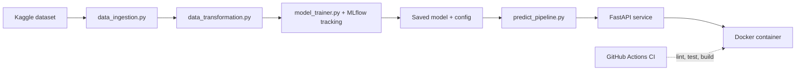

# Sri Lanka Flood Risk Early Warning: An End-to-End MLOps Pipeline


A reproducible machine learning pipeline that predicts, 48 hours in advance, whether a Sri Lankan district will enter a flood advisory. Built to demonstrate production ML practices, not just model accuracy: modular pipeline code, time-aware validation, experiment tracking, a tested and validated inference API, containerization, and CI/CD.

---

## Problem

Sri Lanka regularly faces monsoon flash floods, river overflows and localized inundation. Traditional alerts often treat rainfall volume the same everywhere, ignoring how extreme a rainfall event is for a particular district and how saturated the ground already is. This project uses district-level climate and soil data to forecast flood advisories early enough to act on, rather than confirming that flooding is already underway.

## Dataset

**Source:** [Sri Lanka District Climate and Flood Risk (2015-2024)](https://www.kaggle.com/datasets/rasindupramith/sri-lanka-district-climate-and-flood-risk20152024) on Kaggle, derived from the ECMWF ERA5 reanalysis via the Open-Meteo API.

- **Size:** 91,325 rows (3,653 days x 25 districts), 1 Jan 2015 to 31 Dec 2024, no missing values
- **Granularity:** daily, one row per district per day

| Group | Variables |
|---|---|
| Location | `district`, `latitude`, `longitude`, `province`, `climatic_zone` (Wet / Intermediate / Dry) |
| Atmosphere | `precipitation_sum`, `temperature_2m_max`, `wind_speed_10m_max` |
| Hydrology | topsoil moisture (0-7 cm), subsurface moisture (7-28 cm), `rain_48h`, `rain_72h`, `soil_saturation_index` |
| Risk outputs | `flood_risk_score` (0-100%), `flood_category` (Low Risk, Advisory, High Warning, Critical Emergency) |

**Data quality check:** `precipitation_sum`, `rain_sum` and `rain_24h` are exact duplicate columns in the raw data (verified with a direct equality check across all rows). `precipitation_sum` is used as the canonical column; the other two are dropped.

The risk score and category come from an Extreme Value Theory (Gumbel) model combined with soil saturation. They are model-derived labels, not records of observed flood damage (see [Limitations](#limitations)).

Raw data is not stored in Git (`data/` is gitignored). `data_ingestion.py` reads it from a local CSV (or downloads it via `kagglehub` if missing).

## ML Task

- **Target (`advisory_48h`):** 1 if the district is in Advisory, High Warning or Critical Emergency 48 hours after the observation date, otherwise 0. Positive rate ≈ 7.3% overall.
- **Why 48 hours ahead, not same-day:** `flood_risk_score` and `flood_category` are computed from same-day rainfall and soil variables. A model predicting them from those same same-day inputs would just reproduce the underlying formula. Predicting 2 days ahead, using only each district's own past values, is the meaningful early-warning problem.
- **Features (19 numeric + 2 categorical):** same-day and lagged rainfall (`rain_lag1-3`), rolling accumulations (`rain_3d/7d`, `rain_48h/72h`), rainfall intensity and persistence (`rain_max_7d`, `wet_days_7d`), soil moisture at two depths plus its 3-day change and 7-day mean, temperature, wind, cyclical month encoding, `district`, and `climatic_zone`.
- **Split — chronological, not random:** train 2015–2021, validate on 2022, test on 2023–2024. A random split would let the model see a district's future soil conditions while training on its past, which is unrealistic since the model must work on data collected after training.
- **Metrics:** advisories are rare, so accuracy is misleading (a model that always predicts "no flood" already scores ~93%). Precision, recall, F1 and PR-AUC are used instead, with the decision threshold tuned on validation data to maximize F1 rather than left at the default 0.5.

## Architecture



## Tech Stack

| Area | Tools |
|---|---|
| Language | Python 3.12 |
| ML | pandas, scikit-learn, XGBoost |
| Experiment tracking | MLflow (SQLite backend) |
| Serving | FastAPI, Pydantic, Uvicorn |
| Containers | Docker (multi-stage build), Docker Compose |
| Testing and CI/CD | pytest, flake8, black, GitHub Actions |

## Repository Structure

```
flood_risk_mlops/
├── .github/workflows/main.yml   # CI: lint (flake8/black), pytest, Docker build
├── app/
│   └── main.py                  # FastAPI service: /predict, /predict/batch, /health
├── artifacts/                   # raw.csv, train/val/test.csv (gitignored)
├── configs/
│   └── params.yaml              # paths and pipeline settings
├── data/                        # raw Kaggle CSV (gitignored)
├── models/                      # xgboost_flood_advisory.joblib, model_config.json (gitignored)
├── notebooks/
│   ├── EDA.ipynb                # exploratory data analysis, leakage checks
│   └── model_training.ipynb     # model comparison, CV, threshold tuning
├── src/
│   ├── components/
│   │   ├── data_ingestion.py       # load/validate raw data
│   │   ├── data_transformation.py  # feature engineering, target, time-based split
│   │   └── model_trainer.py        # CV, hyperparameter search, MLflow logging
│   ├── pipeline/
│   │   ├── train_pipeline.py       # runs ingestion -> transformation -> training
│   │   └── predict_pipeline.py     # loads the saved model; used by the API
│   ├── exception.py             # custom exception with file/line context
│   ├── logger.py                 # logging setup
│   └── utils.py                  # save/load helpers (joblib, json)
├── tests/
│   ├── test_data_transformation.py  # feature correctness + per-district leakage test
│   └── test_api.py                  # endpoint status codes and validation
├── Dockerfile                   # multi-stage build
├── docker-compose.yml
├── pytest.ini
├── requirements.txt
└── README.md
```

## Getting Started

```bash
# 1. Clone and set up the environment
git clone https://github.com/aradhya534/flood_risk_mlops.git
cd flood_risk_mlops
python -m venv .venv
source .venv/bin/activate        # Windows: .venv\Scripts\activate
pip install -r requirements.txt

# 2. Run the full pipeline: ingest -> transform -> train
python -m src.pipeline.train_pipeline

# 3. Explore experiment runs
mlflow ui --backend-store-uri sqlite:///mlflow.db

# 4. Serve the model locally
uvicorn app.main:app --reload
```

### Run with Docker

```bash
docker build -t flood-risk-api .
docker run -p 8000:8000 flood-risk-api
# or
docker compose up
```

Interactive API docs (Swagger UI) are available at `http://localhost:8000/docs`.

## Experiment Results

All models were tuned with `RandomizedSearchCV` using expanding-window time-series cross-validation (4 folds) on 2015–2021 data, scored on PR-AUC. Each model's decision threshold was then chosen on 2022 (validation) to maximize F1, rather than left at the default 0.5.

| Model | CV PR-AUC | Val precision | Val recall | Val F1 | Val PR-AUC |
|---|---|---|---|---|---|
| Persistence baseline (today's status = in 2 days) | – | 0.326 | 0.327 | 0.327 | 0.152 |
| Logistic Regression | 0.316 | 0.265 | 0.626 | 0.373 | 0.296 |
| Random Forest | 0.333 | 0.280 | 0.561 | 0.374 | 0.307 |
| LightGBM | 0.336 | 0.290 | 0.587 | 0.388 | 0.318 |
| **XGBoost (selected)** | **0.336** | **0.303** | 0.556 | **0.392** | 0.316 |

**XGBoost** was selected as the final model — best F1 and tied-best CV PR-AUC among all four. A feature-selection experiment (dropping the 4 lowest-importance numeric features) was tested with the same CV setup and reduced PR-AUC from 0.336 to 0.320, so the full feature set was kept.

**Held-out test set (2023–2024, touched exactly once, after every other decision was locked in):**

| Metric | Value |
|---|---|
| Precision | 0.366 |
| Recall | 0.665 |
| F1 | 0.472 |
| PR-AUC | 0.422 |

Test performance exceeded validation across every metric, most likely because 2023–2024 had a higher advisory rate (8.7% vs. 6.8% in 2022) and more clearly extreme events — not a sign the model generalizes better than validation suggested. A two-year test window is a small sample for that claim either way.

**Why not just report accuracy:** the trivial "always predict no flood" rule already scores 93.2% accuracy on this data. The tuned models score 85.8–88.4% — lower, because they deliberately trade some accuracy for far higher recall on the rare, important class. Accuracy alone would make the trivial rule look better than every real model here.

**Feature importance:** for both tree-based models, soil moisture and soil saturation dominate over raw rainfall — matching the physical intuition that flood risk depends on how saturated the ground already is, not just how much rain fell. `district`, taken as a group (all one-hot columns summed), accounted for ~20% of XGBoost's importance but only ~1% of random forest's — suggesting XGBoost partly uses district identity as a proxy for each area's own flood threshold, which random forest instead captures more diffusely through the weather features themselves.

## API Usage

```bash
curl -X POST http://localhost:8000/predict \
  -H "Content-Type: application/json" \
  -d '{
        "records": [
          {
            "date": "2022-01-01",
            "district": "Gampaha",
            "climatic_zone": "Wet",
            "precipitation_sum": 12.4,
            "rain_48h": 22.1,
            "rain_72h": 30.5,
            "soil_moisture_0_to_7cm_mean": 0.42,
            "soil_moisture_7_to_28cm_mean": 0.38,
            "soil_saturation_index": 0.40,
            "temperature_2m_max": 29.1,
            "wind_speed_10m_max": 12.7
          }
          // ... at least 14 consecutive days for one district, so rolling
          // features (7-day sums, etc.) can be computed
        ]
      }'
```

Response:
```json
[
  {
    "date": "2022-01-20T00:00:00",
    "district": "Gampaha",
    "flood_risk_score": 0.076,
    "advisory_predicted": 0
  }
]
```

| Endpoint | Purpose |
|---|---|
| `POST /predict` | Prediction for one district (rejects requests mixing multiple districts) |
| `POST /predict/batch` | Predictions for multiple districts in one request |
| `GET /health` | Service health check |

Input is validated with Pydantic (e.g. soil moisture must be between 0 and 1); invalid or insufficient-history requests return `422` rather than a server error.

## Testing and CI/CD

- **Unit tests (pytest, 11 total):**
  - `test_data_transformation.py` — verifies feature columns are created correctly, rolling windows require enough history before producing values, `rain_7d` matches a manual calculation, and — most importantly — that one district's rolling features never leak into another district's rows
  - `test_api.py` — checks `/health`, a valid `/predict` request, `/predict` correctly rejecting multi-district input, `/predict/batch` accepting it, and Pydantic rejecting out-of-range or missing fields
- **GitHub Actions:** on every push and pull request, the workflow lints with `flake8`, checks formatting with `black`, runs the full `pytest` suite, then builds the Docker image — each step must pass before the next runs

```bash
pytest -v
```

## Limitations

- The labels are outputs of a statistical risk model built on reanalysis data, not confirmed flood events. Model performance reflects how well the model reproduces that risk engine's classification ahead of time, not verified real-world flood outcomes.
- ERA5 is a gridded reanalysis at coarse resolution, so it can miss very local, intense rainfall.
- Flood advisories are rare events; results depend on the chosen decision threshold and evaluation window, and the 2023–2024 test period is a small sample.
- This project is a portfolio demonstration and is not intended for real emergency decisions.

## Future Work

- Data and model versioning with DVC
- Data/concept drift monitoring
- Shadow or canary deployment of new model versions
- Scheduled retraining (continuous training)
- Cloud deployment (Render, Hugging Face Spaces or AWS)
- Live inference using Open-Meteo's historical weather API instead of user-supplied history

## Acknowledgements

- Dataset by [rasindupramith](https://www.kaggle.com/datasets/rasindupramith/sri-lanka-district-climate-and-flood-risk20152024) on Kaggle. Check the dataset page for its license terms.
- Weather data from ECMWF ERA5 via the Open-Meteo API.