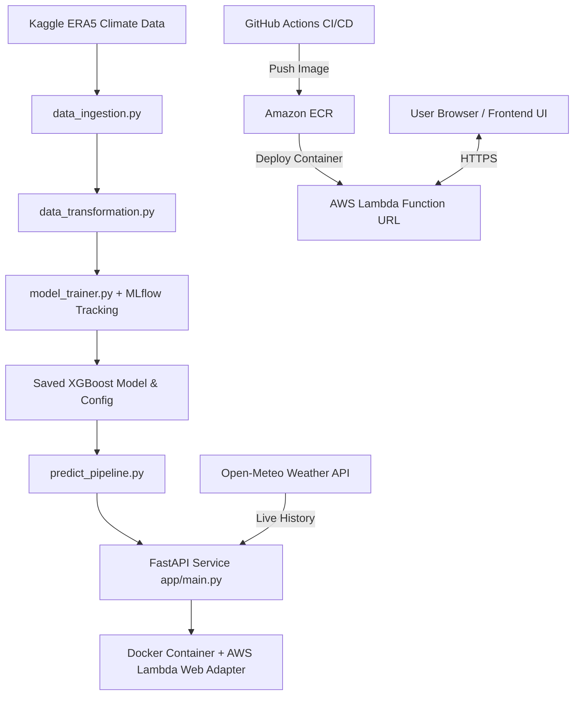

# Sri Lanka Flood Risk Early Warning: An End-to-End MLOps Pipeline


A production-grade, end-to-end Machine Learning pipeline that predicts, 48 hours in advance, whether a Sri Lankan district will enter a flood advisory. Built to showcase modern MLOps practices: modular design, time-aware validation, experiment tracking, a containerized FastAPI serving layer, live weather integration via Open-Meteo API, and automated deployment to **AWS Lambda** via **Amazon ECR** and **GitHub Actions**.

🌐 **Live Production Application:** [https://yxvbxozs27wy2k43hm7ozquqmm0yukta.lambda-url.us-east-1.on.aws/](https://yxvbxozs27wy2k43hm7ozquqmm0yukta.lambda-url.us-east-1.on.aws/)

---

## 📌 Key Highlights

- **Live Real-time Inference:** Accepts latitude and longitude inputs, automatically fetches 21 days of historical weather data from the Open-Meteo API, and generates instant flood risk advisories.
- **Serverless AWS Lambda Deployment:** Containerized with Docker and powered by the **AWS Lambda Web Adapter** to run a full FastAPI web app on AWS Lambda with Function URLs.
- **Automated CI/CD:** GitHub Actions pipeline (`deploy.yml`) builds the Docker image with `--provenance=false`, pushes to **Amazon Elastic Container Registry (ECR)**, and deploys updates directly to AWS Lambda on every push to `main`.
- **Strict Time-aware Splits:** Chronological split (2015–2021 train, 2022 validation, 2023–2024 test) to prevent data leakage and simulate true operational forecasting.
- **Experiment Tracking:** MLflow tracking with threshold tuning to maximize F1 score on imbalanced rare-event data (~7.3% positive rate).

---

## 🏗️ Architecture


```mermaid
flowchart TD
    A[Kaggle ERA5 Climate Data] --> B[data_ingestion.py]
    B --> C[data_transformation.py]
    C --> D[model_trainer.py + MLflow Tracking]
    D --> E[Saved XGBoost Model & Config]
    
    E --> F[predict_pipeline.py]
    F --> G[FastAPI Service app/main.py]
    
    H[Open-Meteo Weather API] -->|Live History| G
    
    G --> I[Docker Container + AWS Lambda Web Adapter]
    
    J[GitHub Actions CI/CD] -->|Push Image| K[Amazon ECR]
    K -->|Deploy Container| L[AWS Lambda Function URL]
    
    M[User Browser / Frontend UI] <-->|HTTPS| L
```

---

## 🛠️ Tech Stack

| Area | Tools & Technologies |
|---|---|
| **Language** | Python 3.12 |
| **ML & Data** | XGBoost, Scikit-Learn, Pandas, NumPy |
| **Experiment Tracking** | MLflow (SQLite backend) |
| **Serving Framework** | FastAPI, Pydantic, Uvicorn, StaticFiles |
| **Data Source** | Open-Meteo API (Live ERA5 reanalysis) & Kaggle |
| **Containerization** | Docker (Multi-stage build), AWS Lambda Web Adapter |
| **Cloud Infrastructure** | AWS Lambda, Amazon ECR (Elastic Container Registry) |
| **Testing & CI/CD** | Pytest, Flake8, Black, GitHub Actions |

---

## 📁 Repository Structure

```
flood_risk_mlops/
├── .github/
│   └── workflows/
│       ├── main.yml             # CI: Linting, Pytest, Docker Build check
│       └── deploy.yml           # CD: Build, Push to ECR, Deploy to AWS Lambda
├── app/
│   └── main.py                  # FastAPI server (/predict, /predict/live, /districts, /health)
├── artifacts/                   # Extracted datasets and outputs (gitignored)
├── configs/
│   ├── districts.csv            # District metadata, coordinates, and climatic zones
│   └── params.yml               # Pipeline parameters
├── data/                        # Kaggle raw climate dataset (gitignored)
├── deploy.ps1                   # Automated local PowerShell deployment script for AWS ECR/Lambda
├── Dockerfile                   # Multi-stage Dockerfile with AWS Lambda Web Adapter
├── docker-compose.yml           # Local multi-container setup
├── models/                      # Trained XGBoost model & model configuration
├── notebooks/
│   ├── EDA.ipynb                # Exploratory Data Analysis & leakage checks
│   └── model_training.ipynb     # Model comparison, cross-validation & threshold tuning
├── src/
│   ├── components/
│   │   ├── data_ingestion.py    # Load raw data
│   │   ├── data_transformation.py # Time-series feature engineering
│   │   └── model_trainer.py     # Model training & MLflow logging
│   ├── pipeline/
│   │   ├── train_pipeline.py    # End-to-end training pipeline runner
│   │   ├── predict_pipeline.py  # Model inference pipeline
│   │   └── weather_fetch.py     # Real-time Open-Meteo weather history fetcher
│   ├── exception.py             # Custom error handling
│   ├── logger.py                # Logging configuration
│   └── utils.py                 # File & model I/O helpers
├── static/
│   └── index.html               # Interactive web advisory dashboard
├── tests/
│   ├── test_api.py              # API endpoint status & validation tests
│   └── test_data_transformation.py # Feature engineering & leakage tests
├── pytest.ini
├── requirements.txt
└── README.md
```

---

## 🚀 Getting Started

### 1. Local Setup
```bash
# Clone repository
git clone https://github.com/aradhya534/flood_risk_mlops.git
cd flood_risk_mlops

# Create & activate virtual environment
python -m venv .venv
.venv\Scripts\activate          # On Linux/macOS: source .venv/bin/activate

# Install dependencies
pip install -r requirements.txt
```

### 2. Run the MLOps Pipeline & MLflow Tracking
```bash
# Execute end-to-end training pipeline
python -m src.pipeline.train_pipeline

# Launch MLflow UI
mlflow ui --backend-store-uri sqlite:///mlflow.db
```

### 3. Run FastAPI Web Server
```bash
uvicorn app.main:app --reload --port 8000
```
Open `http://localhost:8000/` in your browser to view the interactive web dashboard.

---

## 🐳 Docker & AWS Lambda Deployment

### Run Locally with Docker
```powershell
docker build --provenance=false -t flood-risk-api .
docker run -p 8000:8000 flood-risk-api
```

### Deploy to AWS Lambda via Script
You can deploy directly to your AWS Account using [`deploy.ps1`](file:///c:/Users/Acer/Documents/GitHub/flood_risk_mlops/deploy.ps1):
```powershell
.\deploy.ps1 -AwsRegion us-east-1 -AwsAccountId <YOUR_AWS_ACCOUNT_ID>
```

### Automated CI/CD Deployment via GitHub Actions
Add the following secrets under **Repository Settings -> Secrets and variables -> Actions**:
- `AWS_ACCESS_KEY_ID`
- `AWS_SECRET_ACCESS_KEY`
- `AWS_REGION` (e.g. `us-east-1`)

On every `git push origin main`, GitHub Actions will automatically build the container, push it to ECR, and update the live AWS Lambda function.

---

## 📊 Model Performance & Results

Models were trained using expanding-window time-series cross-validation (4 folds) on 2015–2021 data. Decision thresholds were tuned on 2022 validation data to maximize F1 score.

| Model | CV PR-AUC | Val Precision | Val Recall | Val F1 | Val PR-AUC |
|---|---|---|---|---|---|
| Persistence Baseline | – | 0.326 | 0.327 | 0.327 | 0.152 |
| Logistic Regression | 0.316 | 0.265 | 0.626 | 0.373 | 0.296 |
| Random Forest | 0.333 | 0.280 | 0.561 | 0.374 | 0.307 |
| LightGBM | 0.336 | 0.290 | 0.587 | 0.388 | 0.318 |
| **XGBoost (Selected)** | **0.336** | **0.303** | **0.556** | **0.392** | **0.316** |

### Held-Out Test Set (2023–2024)
- **Precision:** 0.366
- **Recall:** 0.665
- **F1 Score:** 0.472
- **PR-AUC:** 0.422

---

## 🌐 API Endpoints

| Endpoint | Method | Purpose |
|---|---|---|
| `/` | `GET` | Interactive Web Dashboard |
| `/predict/live` | `GET` | Fetches Open-Meteo weather history & returns live 48h flood advisory by `lat` & `lon` |
| `/districts` | `GET` | Returns list of all 25 Sri Lankan district centroids and climatic zones |
| `/predict` | `POST` | Single district flood advisory prediction from user-supplied history |
| `/predict/batch` | `POST` | Batch prediction for multiple districts |
| `/health` | `GET` | Health check endpoint |

---

## 🧪 Testing

Run unit tests covering feature transformation, leak prevention, and API contracts:
```bash
pytest -v
```

---

## 📜 License & Acknowledgements

- **Dataset:** [Sri Lanka District Climate and Flood Risk (2015-2024)](https://www.kaggle.com/datasets/rasindupramith/sri-lanka-district-climate-and-flood-risk20152024) by rasindupramith on Kaggle.
- **Weather Data:** ECMWF ERA5 reanalysis via [Open-Meteo API](https://open-meteo.com/).